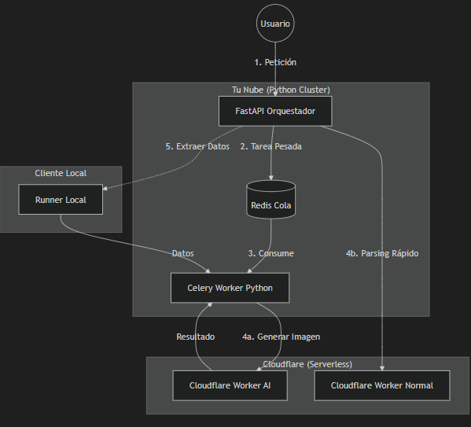

# Arquitectura SaaS Híbrida - ln1_ai_agents_api

Este documento define la arquitectura técnica para la escalabilidad Enterprise, combinando procesamiento en la nube, orquestación inteligente y ejecución distribuida.

## Diagrama de Flujo

## Roles y Responsabilidades Detalladas

### 1. El Orquestador (FastAPI + LangGraph)

**Rol:** "El Cerebro & Director de Orquesta"
Es el único componente que interactúa directamente con el usuario y toma decisiones.

- **Gestión del Estado (State Management):**
  - Mantiene el contexto de la conversación (`OrchestratorState`).
  - Sabe quién es el usuario, de qué empresa viene y qué permisos tiene.
- **Toma de Decisiones (Routing):**
  - Analiza la intención del usuario (usando `IntentEngine` o `Pre-selection`).
  - Decide **QUIÉN** debe resolver el problema:
    - ¿Es una duda simple? -> Responde directo.
    - ¿Requiere datos de ventas? -> Llama al **Runner Local**.
    - ¿Requiere analizar un Excel de 100MB? -> Manda tarea a **Redis/Celery**.
- **Integración y Respuesta:**
  - Centraliza las respuestas de todos los subsistemas y se las entrega al usuario en un formato limpio.

### 2. Cluster de Workers (Python + Celery)

**Rol:** "El Músculo & Procesamiento Pesado"
Servidores dedicados a tareas que consumen mucho CPU/RAM o tiempo.

- **Procesamiento de Archivos:** Carga de Excels gigantes, limpieza de datos (Pandas), generación de PDFs.
- **Lógica de Negocio Compleja:** Algoritmos de comparación, cruce de datos masivos.
- **Gestión de Asincronía:** Permite que el usuario siga chateando mientras su reporte se genera en segundo plano.
- **Consumidor de APIs de IA:** Es quien llama a Cloudflare AI para generar imágenes o textos largos, gestionando los tiempos de espera.

### 3. Cloudflare Workers (Serverless)

**Rol:** "Los Especialistas Externos & AI"
Servicios ligeros o de IA pura que se consumen como API.

- **Workers AI:** Generación de imágenes, transcripción de audio, inferencia de modelos LLM específicos.
- **Workers Normales:** Parsing rápido de webhooks, transformación ligera de JSON, proxys de seguridad.
- **Ventaja:** Permiten "outsourcing" de tareas específicas sin cargar la infraestructura principal.

### 4. Runner Local

**Rol:** "Los Ojos en el Cliente & Seguridad"
Agente ligero instalado en la infraestructura del cliente.

- **Extracción de Datos Segura:** Ejecuta queries SQL directamente en la base de datos local del cliente.
- **Tunneling:** Envía los datos a la nube de forma segura sin exponer la base de datos a internet.
- **Sin Lógica de Negocio:** No piensa, solo obedece órdenes de extracción ("Dame las ventas de ayer") y envía los datos crudos.
